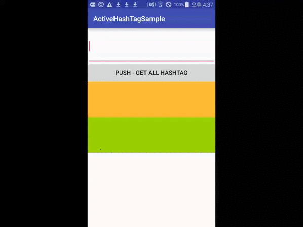

# ActiveHashTag
Android HashTag Lib.

Download
--------

Current version: [0.1.0]

Gradle:
```groovy

```

###Test



## How to use

Test Start
```java
char[] additionalSymbols = new char[]{'_'};
ActiveHashTag editTextTag = ActiveHashTag.Factory.create(ResourcesCompat.getColor(this.getResources(), android.R.color.holo_blue_dark, null), null, additionalSymbols);
editTextTag.operate(editText);
``'
